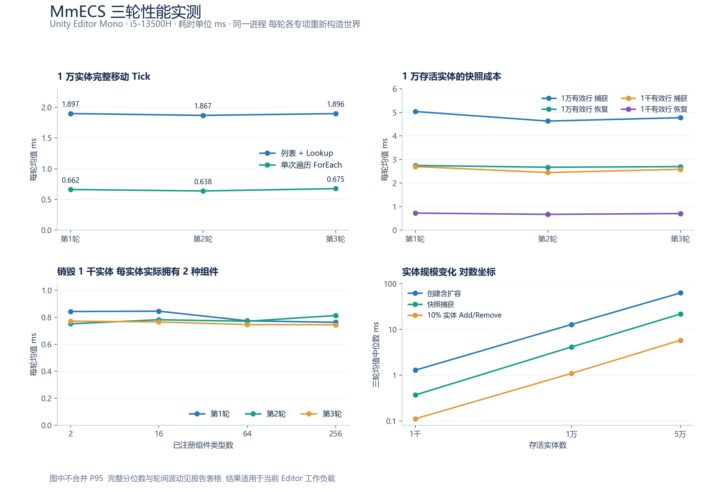

# MmECS 三轮多角度性能报告

测试日期 2026-09-27  当前工作区架构拆分后的实现  所有耗时单位为 ms

本次记录 **3 轮、44 种工作负载配置、132 组耗时摘要、19,440 次正式计时操作**。每轮行为验收均为 **21/21**。GC 专项共记录 270 个区间样本，包含校准区间；同项跨三轮的 15 个分配样本完全一致。

1 万实体、100% 匹配的完整移动 Tick：单次遍历三轮均值中位数 **0.6616 ms**，同轮列表＋Lookup 对照为 **1.8957 ms**；逐轮降低 **64.38%～65.83%**。移动、单移动系统 Tick 和 Signal 稳态采样均为 **0 B**。

当前更值得关注的是批量创建、快照捕获的耗时与长尾，以及结构命令的持续分配。此报告记录当前版本的实测，不将不同日期的旧报告当作同条件优化前后对照。



## 1 测试环境与统计口径

| 项目 | 实测或配置 |
|---|---|
| Unity | 2022.3.62f3  WindowsEditor / Mono |
| CPU | 13th Gen Intel(R) Core(TM) i5-13500H  16 个逻辑处理器 |
| 内存 | 32471 MiB |
| 操作系统 | Windows 11  (10.0.26340) 64bit |
| 电源方案 | 高性能 |
| Editor 进程 | PID 7808  三轮一致 |
| 开始 | 2026-09-27T01:13:27.898881+08:00 |
| 结束 | 2026-09-27T01:15:59.365286+08:00 |
| 编译 | up_to_date  failed=false  compilationFailed=false |
| 计时采样环境 | Edit Mode  Profiler 关闭  Deep Profiling 关闭 |
| 代码一致性 | 100 个源码及 asmdef 的前后 SHA-256 清单完全一致 |

- 三轮在同一 Editor 进程内串行执行，每轮各专项重新构造 World；不是三次独立进程启动。规模矩阵中同规模的多个项目顺序共用状态，快照捕获与恢复也共用该组世界，具体工作量分别列明。没有并行运行基准。未固定 CPU 频率，也没有记录温度与全部后台负载。
- 移动、规模、快照与通信工具先预热，再在计时前执行完整 GC；销毁专项预热 10 次，但没有显式执行 GC。计时内仍可能发生正常 GC 回收。初始化和核验原则上在计时外，明确命名“创建含扩容”的项目包含注册、创建与扩容。
- 表格每轮写作“均值 / P95”。P95 使用该轮排序样本的第 `ceil(N × 0.95)` 项。中位数列是三轮均值的中位数；跨度为 `(最大轮均值 − 最小轮均值) / 三轮均值中位数`，仅描述波动，不是置信区间。
- 各轮 P95 单独保留，不平均 P95、不宣称合并后的 P95。现有工具只返回耗时摘要，未保存逐次耗时序列，因此不补造 P99、最大值或标准差。极少数慢样本可能让均值高于 P95。
- `GC.GetAllocatedBytesForCurrentThread` 本轮仍未通过校准，所有耗时工具的该列均为不可用。分配量只采用第 7 节的 Profiler 原始元数据。原始规模结果中的 `MaxSampledHeapBytes` 是整个 Editor 托管堆采样值，不作为 ECS 独占内存。

| 专项 | 每项预热 | 每轮正式样本 | 工作量 |
|---|---:|---:|---|
| 移动路径 | 30 | 300 | 10,000 实体 100% 位置速度匹配 9 种路径 |
| 规模矩阵 | 10 | 60 | 1,000 / 10,000 / 50,000 实体 8 种路径 |
| 快照密度 | 30 | 300 | 10,000 存活实体 每池有效行 10,000 或 1,000 |
| 销毁类型规模 | 10 | 60 | 销毁 1,000 实体 注册 2 / 16 / 64 / 256 种类型 |
| 通信耗时 | 30 | 300 | 每步 1,000 条消息 含 Core Simulation Tick |
| GC 常规专项 | 5 | 5 | Profiler 子树分配采样 |
| GC 通信专项 | 前述 330 次计时预热与采样 | 5 | 同一已预热通信实例 |

耗时专项顺序：第 1 轮为移动→规模→快照→销毁；第 2 轮为销毁→快照→规模→移动；第 3 轮为快照→移动→销毁→规模。每轮最后执行通信、GC 和行为验收。每轮结束均检查 PID、Profiler 设置与源码指纹。

## 2 移动访问与完整 Tick

每项独立构造 10,000 实体，位置为编号模 32，速度为编号模 7 加 1，速度组件逆序插入。固定步长 0.125 秒。除“只查询”外均使用相同位移公式，计时外逐实体验证最终位置。完整 Tick 使用 SampleSimulation，包含空输入处理、单移动系统和空结构提交。

| 工作负载 | 第1轮 均值 / P95 | 第2轮 均值 / P95 | 第3轮 均值 / P95 | 三轮均值中位数 | 轮间跨度 |
|---|---:|---:|---:|---:|---:|
| 只查询 | 0.4333 / 0.5222 | 0.4255 / 0.5050 | 0.4094 / 0.4816 | 0.4255 | 5.6% |
| 旧路径只更新 | 3.8009 / 4.1603 | 3.7809 / 4.1636 | 3.8173 / 4.1713 | 3.8009 | 1.0% |
| 独立组件池访问基线 | 0.5076 / 0.6323 | 0.5335 / 0.5814 | 0.5146 / 0.5843 | 0.5146 | 5.0% |
| 旧路径完整移动 | 4.2459 / 4.6576 | 4.3216 / 4.7277 | 4.2348 / 4.5758 | 4.2459 | 2.0% |
| 列表Lookup完整移动 | 1.8701 / 2.0791 | 2.0257 / 2.6417 | 1.9317 / 2.1234 | 1.9317 | 8.1% |
| 当前完整移动 | 0.6578 / 0.7596 | 0.7014 / 0.9234 | 0.6522 / 0.7267 | 0.6578 | 7.5% |
| 旧路径完整Tick | 4.3673 / 4.8729 | 4.2868 / 4.6423 | 4.1836 / 4.5377 | 4.2868 | 4.3% |
| 列表Lookup完整Tick | 1.8967 / 2.2099 | 1.8666 / 2.0330 | 1.8957 / 2.1031 | 1.8957 | 1.6% |
| 当前完整Tick | 0.6616 / 0.7398 | 0.6378 / 0.7103 | 0.6753 / 0.7858 | 0.6616 | 5.7% |

“只更新”复用已有实体列表，“完整移动”包含获取匹配实体及更新，“完整 Tick”包含调度。独立组件池基线不承担 World 代际检查，因此不能当作可替换的等价框架路径。表中“旧路径”是同轮执行的保留实现，不是历史报告数值。

列表＋Lookup 完整 Tick 对单次遍历完整 Tick，三轮分别减少 **65.12% / 65.83% / 64.38%**。此对照的实体数、匹配率、更新公式、Tick 数及核验一致。

## 3 创建 查询 随机访问与结构变化的规模

初始位置组件覆盖全部实体，速度组件覆盖 50%。单组件查询读写每实体加 1；多组件交集只产出匹配列表；随机访问按固定种子生成 N 个索引且允许重复，每个访问修改一次位置。这三项承担的工作不同，不能按耗时直接判定某 API 更快。

结构变化比例 10%：Add/Remove 每次先对 K 个实体全部 Add，再全部 Remove，最后执行一次 Tick，合计 2K 条命令。销毁创建复用对 K 个实体各入队一次 Destroy 与双组件 Spawn，含入队和提交；领取 Spawn 结果在计时外。K 在三种规模下分别为 100 / 1,000 / 5,000。销毁复用预热后速度覆盖率为 55%，随后规模矩阵的快照沿用该状态。

### 1,000 实体

| 工作负载 | 第1轮 均值 / P95 | 第2轮 均值 / P95 | 第3轮 均值 / P95 | 三轮均值中位数 | 轮间跨度 |
|---|---:|---:|---:|---:|---:|
| 创建含扩容 | 1.7493 / 5.6971 | 1.2696 / 1.2002 | 1.2855 / 2.4688 | 1.2855 | 37.3% |
| 单组件查询读写 | 0.2241 / 0.2388 | 0.2478 / 0.3111 | 0.2315 / 0.2978 | 0.2315 | 10.2% |
| 多组件交集 | 0.0347 / 0.0354 | 0.0337 / 0.0349 | 0.0322 / 0.0328 | 0.0337 | 7.3% |
| 随机实体访问 | 0.2011 / 0.2512 | 0.1859 / 0.1995 | 0.1949 / 0.2283 | 0.1949 | 7.8% |
| 结构批量Add再Remove | 0.1110 / 0.1162 | 0.1005 / 0.1035 | 0.1242 / 0.1786 | 0.1110 | 21.4% |
| 销毁创建复用 | 0.2164 / 0.2821 | 0.2176 / 0.2882 | 0.2292 / 0.2859 | 0.2176 | 5.9% |
| 快照捕获 | 0.3689 / 0.4236 | 0.3601 / 0.4401 | 0.3796 / 0.4280 | 0.3689 | 5.3% |
| 快照恢复 | 0.2248 / 0.2428 | 0.2282 / 0.2543 | 0.2383 / 0.2905 | 0.2282 | 5.9% |

### 10,000 实体

| 工作负载 | 第1轮 均值 / P95 | 第2轮 均值 / P95 | 第3轮 均值 / P95 | 三轮均值中位数 | 轮间跨度 |
|---|---:|---:|---:|---:|---:|
| 创建含扩容 | 13.1701 / 27.1027 | 12.3950 / 26.3815 | 12.8113 / 26.7730 | 12.8113 | 6.1% |
| 单组件查询读写 | 2.3006 / 2.5574 | 2.3529 / 2.4698 | 2.6373 / 3.2295 | 2.3529 | 14.3% |
| 多组件交集 | 0.3961 / 0.5127 | 0.3413 / 0.4072 | 0.3668 / 0.4030 | 0.3668 | 14.9% |
| 随机实体访问 | 1.9314 / 2.2132 | 1.9424 / 2.2025 | 2.0556 / 2.4017 | 1.9424 | 6.4% |
| 结构批量Add再Remove | 1.0905 / 1.3486 | 1.0655 / 1.1712 | 1.1578 / 1.3041 | 1.0905 | 8.5% |
| 销毁创建复用 | 2.1101 / 2.4347 | 2.1176 / 2.3587 | 2.1276 / 2.3885 | 2.1176 | 0.8% |
| 快照捕获 | 4.1989 / 4.7764 | 4.1286 / 4.5956 | 4.0894 / 4.1094 | 4.1286 | 2.7% |
| 快照恢复 | 2.2965 / 2.5559 | 2.3562 / 2.5438 | 2.2771 / 2.4911 | 2.2965 | 3.4% |

### 50,000 实体

| 工作负载 | 第1轮 均值 / P95 | 第2轮 均值 / P95 | 第3轮 均值 / P95 | 三轮均值中位数 | 轮间跨度 |
|---|---:|---:|---:|---:|---:|
| 创建含扩容 | 62.6680 / 105.3629 | 62.7605 / 107.9713 | 63.8868 / 116.2219 | 62.7605 | 1.9% |
| 单组件查询读写 | 11.8745 / 12.4933 | 11.9255 / 12.6038 | 11.4038 / 12.0755 | 11.8745 | 4.4% |
| 多组件交集 | 1.9329 / 2.2978 | 1.8812 / 2.3566 | 1.7483 / 2.0885 | 1.8812 | 9.8% |
| 随机实体访问 | 11.6261 / 13.6184 | 11.5059 / 14.7620 | 11.0648 / 13.4525 | 11.5059 | 4.9% |
| 结构批量Add再Remove | 5.7579 / 5.9624 | 5.8036 / 6.9112 | 6.0792 / 6.2214 | 5.8036 | 5.5% |
| 销毁创建复用 | 11.3836 / 12.4149 | 11.3448 / 12.3035 | 11.3165 / 12.5320 | 11.3448 | 0.6% |
| 快照捕获 | 21.7638 / 35.2298 | 21.5028 / 35.1721 | 21.9529 / 35.0445 | 21.7638 | 2.1% |
| 快照恢复 | 11.9409 / 12.5417 | 11.8611 / 12.4017 | 11.9765 / 12.7558 | 11.9409 | 1.0% |

创建测量包含 World、注册和数组/列表扩容，属于批量构造成本。它不代表已有实体的每 Tick 更新成本。统一行为验收之外，本专项在计时外检查标签清理和 Spawn 结果领取。

## 4 快照有效行与历史容量

两组都保持 10,000 个实体存活。先加入位置和速度使池扩容，稀疏组再删除低编号 9,000 实体的两种组件，保留高位稀疏索引与原有历史容量；每池剩 1,000 有效行。测量 SampleSimulation 的组合快照，包含 World、时间、系统配置和空未来输入字典。

| 工作负载 | 第1轮 均值 / P95 | 第2轮 均值 / P95 | 第3轮 均值 / P95 | 三轮均值中位数 | 轮间跨度 |
|---|---:|---:|---:|---:|---:|
| 10,000 有效行 / 捕获 | 5.0345 / 8.0921 | 4.6286 / 4.8726 | 4.7712 / 5.0109 | 4.7712 | 8.5% |
| 10,000 有效行 / 恢复 | 2.7454 / 3.0338 | 2.6701 / 2.9125 | 2.6972 / 3.0057 | 2.6972 | 2.8% |
| 1,000 有效行 / 捕获 | 2.6982 / 3.0439 | 2.4460 / 2.7384 | 2.5833 / 3.0007 | 2.5833 | 9.8% |
| 1,000 有效行 / 恢复 | 0.7250 / 0.8500 | 0.6711 / 0.7758 | 0.7062 / 0.8079 | 0.7062 | 7.6% |

按三轮均值中位数比较，减少 90% 组件有效行后，捕获耗时减少 **45.9%**，恢复减少 **73.8%**。这两项是不同工作量的容量敏感性测量，不是优化前后收益。仍保留实体槽位、稀疏索引和历史列表容量，所以成本不会同步减少 90%。所有轮次均通过完整状态比较及活动数据修改后的快照隔离核验。

第 1 轮全有效行捕获 P95 为 8.0921 ms，后两轮为 4.8726 / 5.0109 ms。没有对这些计时样本同步采集 GC 停顿或 CPU 频率，无法将长尾明确归因于 GC、温度或后台任务。

## 5 销毁成本与已注册类型数

每个实体实际只拥有位置和速度两种组件；其他已注册类型为空池。构造、类型注册、快照恢复以及 1,000 条 Destroy 入队都在计时外，仅计一次 Tick 的销毁提交。每次提交后检查位置查询为空及实体失效，因此本表不能与第 3 节“含入队且重新 Spawn”的项目直接相减。

| 工作负载 | 第1轮 均值 / P95 | 第2轮 均值 / P95 | 第3轮 均值 / P95 | 三轮均值中位数 | 轮间跨度 |
|---|---:|---:|---:|---:|---:|
| 注册 2 种 / 销毁 1,000 实体 | 0.8433 / 1.0128 | 0.7518 / 0.7888 | 0.7718 / 0.8700 | 0.7718 | 11.9% |
| 注册 16 种 / 销毁 1,000 实体 | 0.8458 / 0.9516 | 0.7823 / 0.8260 | 0.7661 / 0.8355 | 0.7823 | 10.2% |
| 注册 64 种 / 销毁 1,000 实体 | 0.7743 / 0.8510 | 0.7711 / 0.8123 | 0.7464 / 0.8108 | 0.7711 | 3.6% |
| 注册 256 种 / 销毁 1,000 实体 | 0.7631 / 0.8075 | 0.8137 / 0.9234 | 0.7448 / 0.8125 | 0.7631 | 9.0% |

注册 2 种与 256 种的三轮均值中位数分别为 **0.7718 / 0.7631 ms**。本组未观察到随注册类型数增加而明显增长的销毁成本，与只遍历实体实际归属组件的实现相符。

## 6 Core Signal 与 Event

本专项直接使用 Core 的 Simulation，每次 1,000 条消息。直接调用与 Signal 均调用相同的世界单例累加逻辑，核验最终累计值；Event 将相同数量的数值交给表现订阅者累加，包含生成、发布和逐事件消费。Event 的数据访问与生命周期不同，不能把它比 Signal 更低的耗时解读成等价替代。

| 工作负载 | 第1轮 均值 / P95 | 第2轮 均值 / P95 | 第3轮 均值 / P95 | 三轮均值中位数 | 轮间跨度 |
|---|---:|---:|---:|---:|---:|
| 直接调用含 Tick | 0.0906 / 0.0931 | 0.0978 / 0.1050 | 0.0937 / 0.0977 | 0.0937 | 7.7% |
| Signal 派发含 Tick | 0.2464 / 0.2735 | 0.2490 / 0.2952 | 0.2524 / 0.3053 | 0.2490 | 2.4% |
| Event 生成发布及消费含 Tick | 0.1276 / 0.1322 | 0.1207 / 0.1301 | 0.1277 / 0.1448 | 0.1276 | 5.5% |

## 7 Profiler 分配量与内存代价

通过 RawFrameDataView 读取命名测量区间子树的 GC.Alloc 大小元数据，含托管对象头，仅统计主线程区间内分配。每项每轮 5 次，共 15 次，均得到完全一致的字节数和对象数。Profiler 在采样结束后恢复，所有轮次末的设置与开始一致。

校准在常规与通信工具中分别执行，每轮均满足：空区间 0 B；byte[4096] 为 4,128 B / 1 对象；byte[8192] 为 8,224 B / 1 对象；两个 byte[4096] 为 8,256 B / 2 对象。

| 工作负载 | 第1轮每次 B | 第2轮每次 B | 第3轮每次 B | 每次对象数 |
|---|---:|---:|---:|---:|
| 只查询 10000 实体 | 0 | 0 | 0 | 0 |
| 完整移动 10000 实体 | 0 | 0 | 0 | 0 |
| 完整 Tick 单移动系统 | 0 | 0 | 0 | 0 |
| 恢复后首次 1000 组 Add Remove 含 Tick | 52,000 | 52,000 | 52,000 | 2,000 |
| 连续 1000 组 Add Remove 含 Tick | 52,000 | 52,000 | 52,000 | 2,000 |
| 10000 实体快照捕获 | 666,380 | 666,380 | 666,380 | 24 |
| 10000 实体快照恢复 | 80 | 80 | 80 | 1 |
| 直接调用含 Tick | 0 | 0 | 0 | 0 |
| Signal 派发含 Tick | 0 | 0 | 0 | 0 |
| Event 生成发布及消费含 Tick | 8,608 | 8,608 | 8,608 | 12 |

Add/Remove 的 52,000 B 对应 1,000 组共 2,000 条结构命令，包含单移动系统 Tick；移动本身为 0 B。快照的 666,380 B / 24 对象和恢复的 80 B / 1 对象测的是样例组合快照，不能直接当作单独 World 或纯 Core Simulation 的分配值。Event 的 8,608 B / 12 对象对应同一 Tick 连续 1,000 条 int 事件；交替类型产生更多批次的情况未在本次分配专项测量。

内存取舍仍然明确：已发布事件批次保持独立，快照与活动数组独立，恢复复用历史容量。此处的 0 B 只指预热后指定区间的托管分配，不代表初次注册、所有游戏系统、原生内存或整个 Editor 都不分配。

## 8 行为验证与后续判断

| 轮次 | 完整行为验收 | 专项核验 | GC 校准 |
|---|---|---|---|
| 第1轮 | 21/21 | 通过 | 通过 |
| 第2轮 | 21/21 | 通过 | 通过 |
| 第3轮 | 21/21 | 通过 | 通过 |

专项核验包括移动逐实体位置与 Tick、快照完整状态与隔离、销毁后查询清空与实体失效、结构标签清理与 Spawn 领取、通信最终累计值。验收调用 RunAll(false)，没有覆盖或同步旧报告。本次没有运行场景 FPS、渲染、物理、目标设备或 IL2CPP 测试。

5 万实体创建含扩容的三轮均值中位数为 **62.7605 ms**，三轮 P95 为 **105.3629 / 107.9713 / 116.2219 ms**；同规模快照捕获中位数为 **21.7638 ms**。这些操作的成本与每次实际复制、构造的数据量相关，应按项目的实际触发频率单独预算。

后续小范围优化的优先候选只有两项：高频结构请求的命令对象分配，以及确认需要高频保存时的快照捕获成本。继续使用同工作量对照和现有行为验收；本报告没有证明需要引入 Archetype、Jobs、Burst、生成器或改变组件归属索引。

## 9 数据文件与复现

- [耗时 CSV 132 行](性能数据/2026-09-27-三轮基准/timings.csv)
- [分配 CSV 270 个区间样本](性能数据/2026-09-27-三轮基准/allocations.csv)
- [结构化测量合集](性能数据/2026-09-27-三轮基准/measurements.json)
- [源码指纹 测试前](性能数据/2026-09-27-三轮基准/source-sha256-before.json) / [测试后](性能数据/2026-09-27-三轮基准/source-sha256-after.json)
- 原始 CLI 响应及完整命令保存在同目录 `round-01-*`、`round-02-*`、`round-03-*` JSON 中，包含开始结束时间、退出码、诊断与工具返回的原始摘要。

Git HEAD `2189e1e0b088e1a115cc2eec0828befc90544743`，工作区含大量未提交与未跟踪变更，因此以附带源码 SHA-256 清单标识本轮实现。清单汇总指纹 `1d7d6e151584c66f7163483071f8e7d12d9e593f4ae4acaf5f6b30738e2db95d`。

新增的 `AgentScripts/BenchmarkMmEcsScale.cs` 只是既有规模基准的长任务入口。本次没有修改 Core 或样例运行时代码。运行其他专项时保持默认不写单项报告，统一使用本报告汇总。

```powershell
unity command set_autotick --enable true --project-path 'E:\AAAA学习资料\Demo\顶点数' --format json
unity command recompile --project-path 'E:\AAAA学习资料\Demo\顶点数' --format json
unity command recompile_status --project-path 'E:\AAAA学习资料\Demo\顶点数' --format json
unity command run_script --file AgentScripts/BenchmarkMmEcsMovement.cs --entry BenchmarkMmEcsMovement.Run --timeout_ms 60000 --project-path 'E:\AAAA学习资料\Demo\顶点数' --format json
unity command run_script --file AgentScripts/BenchmarkMmEcsScale.cs --entry BenchmarkMmEcsScale.Run --timeout_ms 60000 --project-path 'E:\AAAA学习资料\Demo\顶点数' --format json
unity command run_script --file AgentScripts/BenchmarkMmEcsSnapshot.cs --entry BenchmarkMmEcsSnapshot.Run --timeout_ms 60000 --project-path 'E:\AAAA学习资料\Demo\顶点数' --format json
unity command run_script --file AgentScripts/ProbeMmEcsDestruction.cs --entry ProbeMmEcsDestruction.Run --timeout_ms 60000 --project-path 'E:\AAAA学习资料\Demo\顶点数' --format json
unity command run_script --file AgentScripts/ProbeMmEcsAllocation.cs --entry ProbeMmEcsAllocation.RunCommunication --timeout_ms 60000 --project-path 'E:\AAAA学习资料\Demo\顶点数' --format json
unity command run_script --file AgentScripts/ProbeMmEcsAllocation.cs --entry ProbeMmEcsAllocation.Run --timeout_ms 60000 --project-path 'E:\AAAA学习资料\Demo\顶点数' --format json
unity command eval --code 'return MmECS.Editor.EcsAcceptanceReport.RunAll(false);' --timeout 60000 --project-path 'E:\AAAA学习资料\Demo\顶点数' --format json
```

确认编译 completed 或 up_to_date 且 failed=false 后，按第 1 节的顺序执行三轮。最终耗时结论只适用于本报告列出的 Editor Mono 工作量，不能外推成整个游戏或目标设备的帧率。
